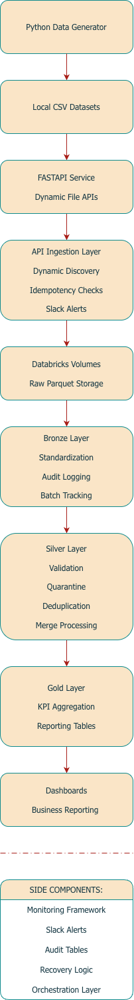
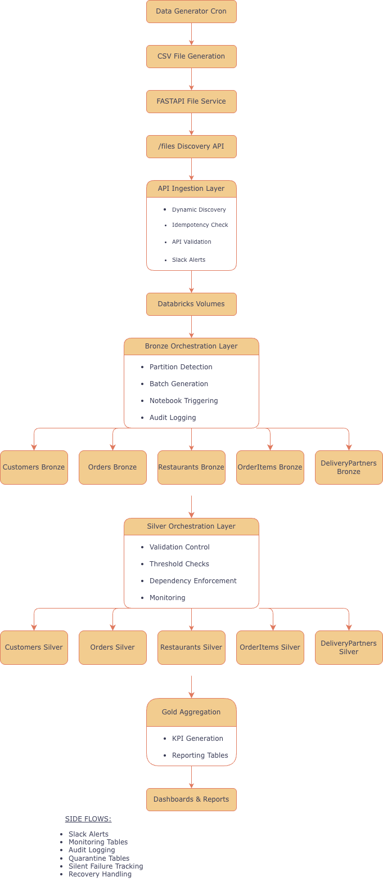

# End-to-End Medallion Data Engineering Pipeline using Databricks

## Project Overview

This project is an end-to-end batch data engineering pipeline built on Databricks using the Medallion Architecture (Bronze, Silver, and Gold layers). The pipeline simulates a real-world food delivery platform where multiple operational datasets such as customers, orders, restaurants, delivery partners, and order items are generated daily, exposed through APIs, ingested into Databricks, validated, transformed, monitored, and finally aggregated for business reporting and analytics.

The project was designed with a strong focus on production-style engineering practices rather than simple ETL development. Along with data ingestion and transformation, the pipeline includes orchestration workflows, audit logging, schema enforcement, schema drift handling, quarantine logic, threshold-based quality validation, silent failure tracking, idempotent ingestion, operational monitoring, and Slack-based alerting.

The ingestion layer dynamically discovers newly generated source files through a FastAPI service and ingests only unprocessed datasets into Databricks Volumes in parquet format. The Bronze layer standardizes raw ingestion and batch tracking, while the Silver layer performs business validations, quarantine handling, deduplication, merge operations, and recovery-safe processing. The Gold layer provides curated business-level aggregations and KPIs for dashboarding and operational analytics.

The project also includes orchestration notebooks, manual debugging/recovery workflows, and monitoring tables to simulate how modern data platforms handle operational reliability, observability, and recovery in production environments.


## Architecture

The pipeline follows a layered Medallion Architecture where raw operational data is generated through Python scripts, exposed through FastAPI endpoints, and dynamically ingested into Databricks using API-driven orchestration. The data then moves through Bronze, Silver, and Gold layers where each stage is responsible for progressively improving data quality, reliability, and business usability.

The system is designed to simulate production-grade batch processing with strong operational controls including monitoring, audit logging, idempotent ingestion, validation thresholds, quarantine handling, orchestration alerts, and recovery workflows.

```text
Data Generator Scripts
        ↓
FastAPI Layer
        ↓
API Ingestion Notebook
(dynamic file discovery + idempotent ingestion + alerts)
        ↓
Databricks Volumes (Raw Parquet Storage)
        ↓
Bronze Orchestration
        ↓
Bronze Layer
(raw standardization + audit logging + schema enforcement)
        ↓
Silver Orchestration
        ↓
Silver Layer
(validation + quarantine + deduplication + merge logic)
        ↓
Gold Layer
(business KPIs + reporting tables)
        ↓
Dashboards & Analytics
```


### Layer Responsibilities

| Layer | Responsibility |
|---|---|
| API Ingestion | Dynamically discovers and ingests newly generated source files |
| Bronze | Raw ingestion, schema standardization, audit logging, batch tracking |
| Silver | Business validations, quarantine handling, deduplication, merge operations |
| Gold | Business-ready aggregated reporting and KPI generation |
| Monitoring Layer | Alerting, orchestration tracking, silent failure detection, operational observability |


## Tech Stack

- Databricks
- PySpark
- Delta Lake
- Python
- SQL
- FastAPI
- Databricks Workflows
- Databricks Volumes
- Slack Webhooks
- Pandas
- Parquet
- Medallion Architecture
- Batch Processing
- REST APIs
- Audit Logging Framework
- Schema Registry & Schema Drift Handling
- Data Quality & Quarantine Framework
- Idempotent File Ingestion
- Monitoring & Alerting System


## Pipeline Workflow

The pipeline is executed in a sequential orchestration flow where each stage depends on the successful completion of the previous layer. The workflow begins with source data generation and API exposure, followed by ingestion into Databricks Volumes, layered transformations across Bronze and Silver, and finally business-level aggregations in the Gold layer.

The orchestration framework also includes monitoring, audit logging, threshold validation, silent failure detection, and operational alerting to ensure controlled batch execution and recovery-safe processing.

### End-to-End Execution Flow

```text
1. Python Data Generator creates daily CSV files
        ↓
2. FastAPI exposes generated files through secured REST endpoints
        ↓
3. API Ingestion Notebook dynamically discovers available files
        ↓
4. New files are ingested into Databricks Volumes in parquet format
        ↓
5. API ingestion alerts are triggered for ingestion status monitoring
        ↓
6. Bronze Orchestration Notebook identifies newly arrived partitions
        ↓
7. Bronze Layer notebooks process raw datasets independently
        ↓
8. Bronze monitoring and batch audit logs are updated
        ↓
9. Silver Orchestration Notebook identifies successful Bronze batches
        ↓
10. Silver Layer notebooks apply validations and business rules
        ↓
11. Invalid records are quarantined into dedicated quarantine tables
        ↓
12. Deduplication and merge logic update Silver tables
        ↓
13. Silent failures are tracked for manual recovery workflows
        ↓
14. Gold Layer notebook generates business-level aggregations
        ↓
15. Dashboard and reporting tables are refreshed
        ↓
16. Final orchestration alerts summarize pipeline execution status
```
### Orchestration Principles

The orchestration layer was designed with a strong focus on operational reliability and recovery-safe execution. Each layer processes only validated upstream batches to prevent cascading failures across the pipeline.

Key orchestration principles implemented in the project include:

- Batch-level execution tracking
- File-level idempotency
- Layer dependency enforcement
- Partition-aware processing
- Threshold-based failure handling
- Silent failure detection
- Manual recovery workflows
- Operational alerting and monitoring
- Controlled downstream execution

### Notebook Organization

The pipeline is modularized into dedicated notebooks for each processing layer and entity-specific transformation logic.

| Notebook Type | Purpose |
|---|---|
| Data Generator Script | Simulates operational source system data |
| FastAPI Script | Exposes generated files through APIs |
| API Ingestion Notebook | Dynamically ingests newly available source files |
| Bronze Layer Notebooks | Raw ingestion and schema standardization |
| Bronze Orchestration | Controls Bronze layer execution |
| Silver Layer Notebooks | Validation, quarantine, deduplication, merge logic |
| Silver Orchestration | Controls Silver layer execution |
| Gold Layer Notebook | Business aggregations and KPI generation |
| Alerting Notebook | Pipeline monitoring and Slack notifications |


## Key Features

| Feature | Description |
|---|---|
| Dynamic API-Driven Ingestion | Automatically discovers newly generated source files through FastAPI endpoints |
| File-Level Idempotency | Prevents duplicate ingestion of already processed files |
| Medallion Architecture | Implements Bronze, Silver, and Gold layered data processing |
| Batch-Level Processing | Processes data using controlled partition-aware batch execution |
| Schema Enforcement | Standardizes incoming data structures before downstream processing |
| Schema Drift Handling | Detects and manages evolving source schemas safely |
| Quarantine Framework | Invalid records are isolated into quarantine tables with failure reasons |
| Threshold-Based Validation | Batch failures are triggered when invalid data exceeds configured thresholds |
| Deduplication Logic | Uses window functions and latest-record selection for conflict resolution |
| Incremental Merge Processing | Silver tables are updated using controlled merge strategies |
| Silent Failure Detection | Tracks partially failed tables requiring manual debugging |
| Manual Recovery Workflow | Supports selective table-level reprocessing and debugging |
| Audit Logging Framework | Captures operational events and pipeline activity across layers |
| Slack Alerting System | Sends operational alerts for ingestion, orchestration, and failures |
| Operational Monitoring Tables | Stores pipeline execution metrics and monitoring data |
| Recovery-Safe Orchestration | Prevents downstream execution when upstream failures occur |
| Gold Layer KPI Aggregations | Generates business-ready reporting and analytics datasets |
| Dashboard-Ready Outputs | Gold tables are structured for reporting and BI visualization |

### Engineering Focus Areas

This project was intentionally designed to focus not only on data transformation but also on operational reliability, observability, and production-inspired engineering practices. Significant emphasis was placed on:

- Recovery-safe orchestration
- Monitoring and operational visibility
- Failure isolation and debugging
- Idempotent processing
- Data quality enforcement
- Scalable notebook modularization
- Controlled downstream dependencies
- Production-style alerting and auditability

### Business Simulation

The pipeline simulates a food delivery platform ecosystem where operational datasets are generated daily across multiple entities including:

- Customers
- Orders
- Order Items
- Restaurants
- Delivery Partners

The generated data is processed through a complete analytical pipeline to simulate real-world reporting, operational analytics, and business KPI generation.


## Bronze Layer

The Bronze layer is responsible for raw ingestion standardization, batch tracking, schema enforcement, and operational observability. Newly arrived parquet files from Databricks Volumes are processed through entity-specific Bronze notebooks where metadata columns, ingestion timestamps, batch identifiers, and audit logging information are appended.

The Bronze orchestration framework dynamically identifies newly arrived partitions and triggers downstream processing only for valid datasets. The layer also maintains monitoring tables for ingestion tracking, operational logging, and batch-level execution visibility.

### Bronze Layer Responsibilities

- Raw parquet ingestion from Databricks Volumes
- Batch identifier generation and tracking
- Schema standardization
- Metadata enrichment
- Audit logging
- Partition-aware processing
- Bronze monitoring metrics
- Orchestration-driven execution
- Operational alert generation


## Silver Layer

The Silver layer performs data validation, business rule enforcement, quarantine handling, deduplication, and incremental merge processing. Each entity-specific Silver notebook validates Bronze records against operational quality rules and isolates invalid records into dedicated quarantine tables for investigation and recovery workflows.

The Silver orchestration framework processes only successfully completed Bronze batches and prevents downstream execution for failed or partially processed datasets. The layer also tracks validation metrics, threshold breaches, silent failures, and merge statistics through monitoring tables and operational alerts.

### Silver Layer Responsibilities

- Business rule validation
- Invalid data quarantine
- Threshold-based batch failure handling
- Deduplication using window functions
- Incremental merge processing
- Batch-level monitoring
- Validation metrics tracking
- Silent failure detection
- Recovery-safe downstream execution
- Operational alerting


## Gold Layer

The Gold layer provides curated business-level aggregations and KPI reporting tables optimized for dashboards, reporting, and operational analytics. The layer transforms validated Silver datasets into business-consumable metrics related to revenue, order trends, restaurant performance, and item-level analytics.

Gold tables are designed to support reporting use cases while maintaining simplified analytical access patterns for dashboard consumption.

### Gold Layer Tables

| Table | Purpose |
|---|---|
| gold_daily_business_summary | Daily operational KPI reporting |
| gold_restaurant_performance | Restaurant-level revenue and order analytics |
| gold_item_performance | Item-level sales and performance tracking |

### Gold Layer Responsibilities

- KPI aggregation
- Business reporting
- Dashboard-ready table creation
- Revenue analytics
- Order trend analysis
- Restaurant performance analysis
- Item-level performance tracking


## Monitoring & Alerting

The pipeline includes a dedicated operational monitoring and alerting framework designed to improve observability, failure detection, and recovery management across all processing layers. Monitoring tables, audit logs, orchestration tracking, validation metrics, and Slack-based alerts are integrated throughout the pipeline lifecycle.

The monitoring framework was designed to simulate production-style operational controls where pipeline health, batch execution, validation failures, ingestion anomalies, and downstream dependencies are continuously tracked and communicated.

### Monitoring Capabilities

| Capability | Description |
|---|---|
| Batch Execution Tracking | Tracks execution state across Bronze and Silver layers |
| Audit Logging | Captures operational events and processing stages |
| Validation Metrics | Tracks valid, invalid, quarantined, and deduplicated records |
| Threshold Monitoring | Fails batches when invalid record percentage exceeds limits |
| Silent Failure Detection | Identifies partially processed or skipped datasets |
| File Arrival Monitoring | Detects newly arrived partitions before orchestration |
| API Ingestion Monitoring | Tracks API ingestion success, skips, failures, and empty datasets |
| Merge Monitoring | Captures merge operation statistics and outcomes |
| Quarantine Monitoring | Tracks isolated invalid records and failure reasons |
| Downstream Dependency Control | Prevents downstream execution for failed upstream batches |
| Recovery Tracking | Supports manual recovery and selective reprocessing workflows |

### Alerting System

Slack-based operational alerts are triggered throughout the pipeline lifecycle to provide execution visibility and anomaly detection.

Alert categories implemented in the project include:

- Source API ingestion alerts
- File arrival alerts
- Bronze orchestration alerts
- Silver orchestration alerts
- Validation threshold breach alerts
- Quarantine alerts
- Partial success alerts
- Silent failure alerts
- Pipeline completion alerts
- Operational anomaly alerts

The alerting framework dynamically adjusts severity levels based on execution outcomes and processing health.

### Failure Handling Strategy

The pipeline implements recovery-safe execution principles to minimize cascading downstream failures.

Failure handling mechanisms include:

- Threshold-based validation stopping
- Layer dependency enforcement
- Partition-level execution control
- Invalid data isolation
- Manual recovery workflows
- Idempotent ingestion protection
- Silent failure tracking
- Controlled downstream blocking
- Operational alert escalation

These mechanisms help ensure that downstream layers process only validated and operationally safe datasets.

## Data Model

The pipeline processes operational data for a simulated food delivery platform ecosystem. Multiple transactional and master datasets are generated daily and processed through layered transformations to support operational reporting and business analytics.

The data model is centered around customer orders, restaurants, delivery operations, and item-level transactions.

### Source Entities

| Entity | Description |
|---|---|
| customers | Customer master data |
| orders | Order-level transactional data |
| order_items | Item-level order breakdown |
| restaurants | Restaurant master and operational details |
| delivery_partners | Delivery partner operational data |

### Entity Relationships

| Parent Table | Child Table | Relationship |
|---|---|---|
| customers | orders | One customer can place multiple orders |
| orders | order_items | One order can contain multiple items |
| restaurants | orders | One restaurant can receive multiple orders |
| delivery_partners | orders | One delivery partner can deliver multiple orders |

### Business Transaction Flow

```text
Customer
    ↓
Places Order
    ↓
Restaurant Receives Order
    ↓
Order Contains Multiple Items
    ↓
Delivery Partner Completes Delivery
    ↓
Business KPIs Generated in Gold Layer
```

### Analytical Focus Areas

The Gold layer supports analytical reporting across multiple operational dimensions including:

- Daily revenue trends
- Order completion metrics
- Restaurant performance analytics
- Item-level sales analysis
- Average order value tracking
- Delivery operational insights
- Customer ordering behavior
- Business KPI reporting


## Project Structure
```text
project-root/
│
├── README.md
│
├── requirements.txt
│
├── docs/
│   ├── pipeline_setup.md
│   ├── architecture.md
│   ├── api_ingestion.md
│   ├── bronze_layer.md
│   ├── silver_layer.md
│   ├── gold_layer.md
│   ├── orchestration.md
│   ├── monitoring_alerts.md
│   └── recovery_debugging.md
│
├── assets/
│   ├── architecture_diagram.png
│   ├── dashboard_screenshots/
│   └── orchestration_flow.png
│
├── scripts/
│   ├── data_generator.py
│   └── fastapi_service.py
│
├── notebooks/
|   ├── tables/
│   ├── api_ingestion/
│   ├── bronze/
│   ├── silver/
│   ├── gold/
│   ├── orchestration/
│   └── alerts/
│   
└── dashboards/
```

### Repository Organization

The repository is organized into modular components to separate ingestion, transformation, orchestration, monitoring, and reporting responsibilities.

| Folder | Purpose |
|---|---|
| scripts | Source data generation and FastAPI services |
| notebooks/api_ingestion | Dynamic API-driven ingestion workflows |
| notebooks/bronze | Bronze layer ingestion and standardization notebooks |
| notebooks/silver | Validation, quarantine, and merge processing notebooks |
| notebooks/gold | Business aggregation and KPI generation notebooks |
| notebooks/orchestration | Layer orchestration and execution control notebooks |
| notebooks/alerts | Slack alerting and operational notification notebooks |
| monitoring | Audit tables, monitoring logic, and recovery tracking |
| assets | Architecture diagrams and dashboard screenshots |
| docs | Detailed technical documentation |
| dashboards | Dashboard and reporting assets |

### Modular Design Approach

The pipeline was intentionally modularized to improve maintainability, debugging, recovery workflows, and orchestration control.

Each entity-specific processing notebook operates independently while orchestration notebooks coordinate execution sequencing and dependency management across layers.

This modular design also simplifies:

- Selective table reprocessing
- Manual debugging workflows
- Silent failure recovery
- Incremental feature enhancement
- Operational troubleshooting
- Monitoring and alert isolation


## Dashboard & Reporting

The Gold layer produces business-ready analytical datasets optimized for dashboarding and operational reporting. These curated tables are designed to support KPI monitoring, revenue analysis, operational tracking, and business performance evaluation for the simulated food delivery platform.

The reporting layer transforms validated transactional datasets into simplified analytical structures suitable for BI visualization and executive reporting.

### Gold Reporting Tables

| Table | Reporting Purpose |
|---|---|
| gold_daily_business_summary | Daily operational KPI monitoring |
| gold_restaurant_performance | Restaurant-level performance analytics |
| gold_item_performance | Item-level sales and popularity analysis |

### Business KPIs Generated

The reporting layer supports multiple business and operational KPIs including:

- Total orders
- Completed orders
- Failed orders
- Gross revenue
- Net revenue
- Average order value
- Unique restaurant activity
- Item sales performance
- Restaurant revenue trends
- Daily business summaries
- Operational order trends

### Dashboard Objectives

The dashboard layer was designed to provide visibility into:

- Daily business performance
- Revenue and operational trends
- Restaurant-level performance
- Item-level sales insights
- Order fulfillment metrics
- Platform activity monitoring

The reporting structure supports simplified dashboard integration while maintaining analytical consistency with upstream validated datasets.

### Dashboard Screenshots

> Dashboard screenshots and visualizations will be added here.


## Future Improvements

The current implementation focuses on building a production-inspired batch processing pipeline with strong operational controls and monitoring capabilities. Several enhancements and scalability improvements can be introduced in future iterations of the project.

| Enhancement Area | Future Improvement |
|---|---|
| Streaming Architecture | Extend the pipeline to support near real-time streaming ingestion |
| Workflow Scheduling | Migrate orchestration to fully automated production scheduling |
| CI/CD Integration | Add automated deployment pipelines for notebooks and configurations |
| Infrastructure as Code | Manage infrastructure resources using Terraform |
| Data Quality Framework | Integrate dedicated data quality tooling such as Great Expectations |
| Unit Testing | Add automated testing for transformation logic and orchestration workflows |
| Metadata Management | Introduce centralized metadata-driven processing frameworks |
| Secrets Management | Replace hardcoded credentials with secure secret management |
| Dashboard Expansion | Add advanced business dashboards and operational visualizations |
| Performance Optimization | Introduce partition optimization and query performance tuning |
| Monitoring Expansion | Add centralized observability dashboards and metric tracking |
| Containerization | Deploy FastAPI services through Docker-based infrastructure |
| Cloud Deployment | Migrate local API hosting to cloud-based compute infrastructure |
| Recovery Automation | Build automated retry and recovery orchestration for failed batches |
| Data Cataloging | Integrate metadata catalog and lineage tracking solutions |

### Scalability Vision

The long-term design goal of the project is to evolve from a local batch-processing simulation into a more production-oriented cloud-native data platform with scalable orchestration, automated recovery workflows, centralized monitoring, and advanced observability capabilities.

### Key Learning Outcomes

This project provided hands-on experience across multiple areas of modern data engineering including:

- Medallion architecture implementation
- Batch orchestration design
- API-driven ingestion workflows
- Data validation and quarantine strategies
- Operational monitoring and alerting
- Incremental merge processing
- Recovery-safe pipeline design
- Idempotent ingestion patterns
- Delta Lake processing
- Business KPI aggregation
- Production-style observability concepts


## Pipeline Execution Flow

### 1. Generate Source Data
The Python-based data generator creates operational CSV datasets on the local machine.

### 2. Start FastAPI Service
FastAPI exposes dynamically generated datasets through secured REST APIs.

### 3. Databricks Workflow Execution
Databricks Jobs orchestrate the end-to-end pipeline execution, including:

- API ingestion
- Bronze layer processing
- Silver validation workflows
- Gold aggregation processing
- Monitoring and alerting

### 4. Monitoring & Alerts
Operational monitoring and Slack alerts provide execution visibility, failure tracking, and downstream dependency control.

### 5. Dashboard Consumption
Gold reporting tables power dashboard visualizations and business analytics reporting.




